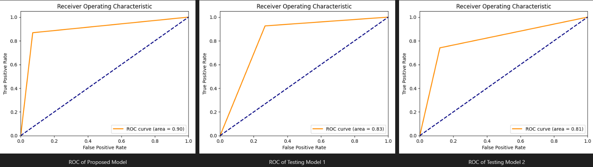

# Alzheimer-Disease-Detection

- [Alzheimer-Disease-Detection](#alzheimer-disease-detection)
  - [Introduction](#introduction)
  - [Preprocessing](#preprocessing)
  - [Model](#model)
    - [Gloroit Initialization](#gloroit-initialization)
    - [Activation Function](#activation-function)
    - [Loss Function](#loss-function)
    - [Optimizer](#optimizer)
    - [Regularization](#regularization)
    - [Dropout](#dropout)
    - [Batch Normalization](#batch-normalization)
    - [Model Architecture](#model-architecture)
  - [Results](#results)
    - [Loss and Accuracy](#loss-and-accuracy)
    - [Classification Report](#classification-report)
    - [Confusion Matrix](#confusion-matrix)
    - [ROC Curve](#roc-curve)
  - [Conclusion](#conclusion)
  - [Contributors](#contributors)

## Introduction

Alzheimer's disease (AD) is a neurodegenerative disorder that affects millions of people worldwide. It is the most common cause of dementia and is characterized by a progressive decline in cognitive function, memory loss, and changes in behavior. Early diagnosis of AD is crucial for effective treatment and management of the disease. Magnetic resonance imaging (MRI) is a powerful tool for detecting structural changes in the brain associated with AD. In this project, we will develop a Convolutional Neural Network (CNN) to classify MRI images of patients with AD, Mild Cognitive Impairment (MCI), and normal control (NC) subjects. The goal is to build a model that can accurately differentiate between these three groups and help in the early diagnosis of AD, so in this project (which is based on this [paper](https://www.researchgate.net/publication/349874169_A_CNN_based_framework_for_classification_of_Alzheimer's_disease)) we aim to classify MCI and AD using MRI pictures. This project is based on this. The paar aims to classify Alzheimer's disease (AD) and Mild Cognitive Impairment (MCI) and normal control (NC) using MRI images. The dataset used in this project is a subclass of the [ADNI dataset](http://adni.loni.usc.edu/). The dataset contains 1654 pictures, of which 965 are AD and the rest are MCI.

## Preprocessing

The given dataset has already converted MRI images to black and white jpg images. The images are of size 256x256. It was already preprocessed so we only needed to implement data augmentation. The data augmentation was implemented using the `ImageDataGenerator` class from the `keras.preprocessing.image` module. Some sample output images are shown below:

## Model

### Gloroit Initialization

The Glorot initialization, also known as Xavier initialization, is a method used to initialize the weights of a neural network. It is based on the idea that the weights should be initialized in such a way that the variance of the input and output of each layer is the same. This helps to prevent the gradients from becoming too large or too small during training. For a fully connected layer with input size `n_in` and output size `n_out`, the weights `W` are initialized according to a uniform distribution in the range:

$$
W \sim U\left[-\sqrt{\frac{6}{n_{in} + n_{out}}}, \sqrt{\frac{6}{n_{in} + n_{out}}}\right]
$$

Here, `U[a, b]` denotes a uniform distribution in the range `[a, b]`. This initialization helps to avoid vanishing or exploding gradients at the start of the training process.

### Activation Function

We will use the ReLU activation function in the hidden layers of the network. The ReLU function is a non-linear activation function that introduces non-linearity into the network and helps to learn complex patterns in the data. tanh and sigmoid activation functions are also used in the network. For output layer we will use softmax activation function.

Formulas for each of the activation functions are as follows:

$$ReLU(x) = max(0, x)$$

$$tanh(x) = \frac{e^{x} - e^{-x}}{e^{x} + e^{-x}}$$

$$sigmoid(x) = \frac{1}{1 + e^{-x}}$$

$$softmax(x) = \frac{e^{x_{i}}}{\sum_{j} e^{x_{j}}}$$

### Loss Function

We will use the categorical cross-entropy loss function to train the model. The categorical cross-entropy loss function is used for multi-class classification problems and measures the difference between the predicted probability distribution and the true probability distribution of the classes. The formula for the categorical cross-entropy loss function is as follows:

$$L(y, \hat{y}) = -\frac{1}{N} \sum_{i = 1}^{N} \sum_{j = 1}^{C} (y_{i} = j) log(\hat{y}_{i})$$

Where $y$ is the true probability distribution, $\hat{y}$ is the predicted probability distribution, and $N$ is the number of classes.

Using Cross-Entropy loss function after the softmax layer speeds the convergence of the neural network due to the gradient vanishing problem.

Another possible loss function is the negative log-likelihood loss function. The negative log-likelihood loss function is used for multi-class classification problems and measures the difference between the predicted probability distribution and the true probability distribution of the classes. The formula for the negative log-likelihood loss function is as follows:

$$L(y, \hat{y}) = -\frac{1}{N} \sum_{i} log(\hat{y}_{i})$$

Where $y$ is the true probability distribution, $\hat{y}$ is the predicted probability distribution, and $N$ is the number of classes.

The reason we chose the categorical cross-entropy loss function is that it is more stable and faster to converge than the negative log-likelihood loss function.

### Optimizer

We will use the Adam optimizer to train the model. The Adam optimizer is an adaptive learning rate optimization algorithm that combines the advantages of two other popular optimization algorithms: AdaGrad and RMSProp. The Adam optimizer adapts the learning rate for each parameter based on the first and second moments of the gradients. This helps to speed up the convergence of the model and improve its performance.

### Regularization

We will use L2 regularization to prevent overfitting in the model. L2 regularization adds a penalty term to the loss function that penalizes large weights. This helps to prevent the model from fitting the noise in the training data and improves its generalization performance. The L2 regularization term is given by:

$$L2 = \lambda \sum_{i} w_{i}^{2}$$

Where $\lambda$ is the regularization strength and $w_{i}$ are the weights of the model.

### Dropout

We will use dropout regularization to prevent overfitting in the model. Dropout is a technique that randomly sets a fraction of the input units to zero during training. This helps to prevent the model from relying too much on any single input unit and improves its generalization performance. We will apply dropout to the hidden layers of the network.

### Batch Normalization

We will use batch normalization to improve the training of the model. Batch normalization is a technique that normalizes the input to each layer of the network to have zero mean and unit variance. This helps to stabilize the training process and speed up convergence. We will apply batch normalization to the hidden layers of the network.

### Model Architecture

The model architecture consists of a series of convolutional layers followed by max-pooling layers. The convolutional layers extract features from the input images, while the max-pooling layers downsample the feature maps to reduce the spatial dimensions. The output of the convolutional layers is flattened and passed through a series of fully connected layers to make the final prediction. The model uses ReLU activation functions in the hidden layers and softmax activation function in the output layer. The model is trained using the categorical cross-entropy loss function and the Adam optimizer.

The model architecture is as follows:

1. Convolutional Layer (32 filters, kernel size 3x3, stride 1x1, padding same)
2. Batch Normalization
3. ReLU Activation
4. Dropout (0.5)
5. Convolutional Layer (32 filters, kernel size 3x3, stride 1x1, padding same)
6. Batch Normalization
7. ReLU Activation
8. Max Pooling (pool size 2x2, stride 2x2)
9. Convolutional Layer (32 filters, kernel size 3x3, stride 1x1, padding same)
10. Batch Normalization
11. ReLU Activation
12. Dropout (0.5)
13. Convolutional Layer (32 filters, kernel size 3x3, stride 1x1, padding same)
14. Batch Normalization
15. ReLU Activation
16. Max Pooling (pool size 2x2, stride 2x2)
17. Flatten
18. Fully Connected Layer (128 units)
19. Batch Normalization
20. ReLU Activation
21. Dropout (0.5)
22. Fully Connected Layer (64 units)
23. Batch Normalization
24. ReLU Activation
25. Dropout (0.5)
26. Fully Connected Layer (2 units)
27. Softmax Activation
28. Output Layer
29. Categorical Cross-Entropy Loss Function
30. Adam Optimizer

The visual representation of the model architecture is shown below:

Two other models were also implemented, one with a different number of filters and the other with a different number of layers, in order to compare the results of the three models.

## Results

### Loss and Accuracy

The loss and accuracy of the model were monitored during training using the `EarlyStopping` callbacks. The model was trained for 50 epochs with a batch size of 32. The results of the three models are shown below:

### Classification Report

The classification report of the model was generated using the `classification_report` function from the `sklearn.metrics` module. The classification report shows the precision, recall, and F1-score of the model for each class. The results of the three models are shown below:

| Model           | Precision | Recall | F1-Score | Support |
|-----------------|-----------|--------|----------|---------|
| **Proposed Model**  |           |        |          |         |
| Class 0         | 0.81      | 0.93   | 0.87     | 126     |
| Class 1         | 0.95      | 0.87   | 0.91     | 205     |
| *Accuracy*        |           |        | **0.89**     | **331**     |
| *Macro Avg*       | **0.88**      | **0.90**   | **0.89**     | **331**     |
| *Weighted Avg*    | **0.90**      | **0.89**   | **0.89**     | **331**     |
| **Testing Model 1** |           |        |          |         |
| Class 0         | 0.88      | 0.73   | 0.80     | 142     |
| Class 1         | 0.82      | 0.93   | 0.87     | 189     |
| *Accuracy*        |           |        | **0.84**     | **331**     |
| *Macro Avg*       | **0.85**      | **0.83**   | **0.84**     | **331**     |
| *Weighted Avg*    | **0.85**      | **0.84**   | **0.84**     | **331**     |
| **Testing Model 2** |           |        |          |         |
| Class 0         | 0.72      | 0.88   | 0.79     | 142     |
| Class 1         | 0.89      | 0.74   | 0.81     | 189     |
| *Accuracy*        |           |        | **0.80**     | **331**     |
| *Macro Avg*       | **0.81**      | **0.81**   | **0.80**     | **331**     |
| *Weighted Avg*    | **0.82**      | **0.80**   | **0.80**     | **331**     |

The classification report shows that the proposed model has the highest accuracy and F1-score among the three models. The proposed model has a higher precision and recall for both classes compared to the other two models. The classification report shows that the proposed model has fewer false positive and false negative predictions compared to the other two models.

### Confusion Matrix

The confusion matrix of the model was generated using the `confusion_matrix` function from the `sklearn.metrics` module. The confusion matrix shows the number of true positive, true negative, false positive, and false negative predictions for each class. The results of the three models are shown below:

Proposed Model:

| True\Predicted | Class 0 | Class 1 |
|----------------|---------|---------|
| Class 0        | 117     | 9       |
| Class 1        | 27      | 178     |

Testing Model 1:

| True\Predicted | Class 0 | Class 1 |
|----------------|---------|---------|
| Class 0        | 104     | 38      |
| Class 1        | 14      | 175     |

Testing Model 2:

| True\Predicted | Class 0 | Class 1 |
|----------------|---------|---------|
| Class 0        | 125     | 17      |
| Class 1        | 49      | 140     |

The confusion matrix shows that the proposed model has the highest accuracy and F1-score among the three models. The proposed model has a higher precision and recall for both classes compared to the other two models. The confusion matrix shows that the proposed model has fewer false positive and false negative predictions compared to the other two models.

### ROC Curve

The ROC curve of the model was generated using the `roc_curve` function from the `sklearn.metrics` module. The ROC curve shows the true positive rate (sensitivity) versus the false positive rate (1-specificity) for different threshold values. The area under the ROC curve (AUC) is a measure of the model's performance, with a higher AUC indicating better performance. The results of the three models are shown below:

As shown in the ROC curves, the proposed model has the highest AUC among the three models, indicating better performance. The ROC curve of the proposed model is closer to the top-left corner, which is the ideal position for a perfect classifier. The ROC curve of the proposed model has a higher true positive rate and a lower false positive rate compared to the other two models.

## Conclusion

In this project, we developed a Convolutional Neural Network (CNN) to classify MRI images of patients with AD, and MCI. The proposed model achieved an accuracy of 0.89 and an F1-score of 0.89, outperforming the other two models. The proposed model has a higher precision and recall for both classes compared to the other two models. The proposed model has fewer false positive and false negative predictions compared to the other two models. The ROC curve of the proposed model has the highest AUC among the three models, indicating better performance. The proposed model is able to accurately differentiate between AD, and MCI subjects and can help in the early diagnosis of AD. The rest of of the notebook is trying to tune the model to get better results, which you can check in the notebook. The numbers represented in previous part are the results of the model with the best hyperparameters.

## Contributors

- [Matin Bazrafshan](https://github.com/FabulousMatin)
- [Shahriar Attar](https://github.com/Shahriar-0)